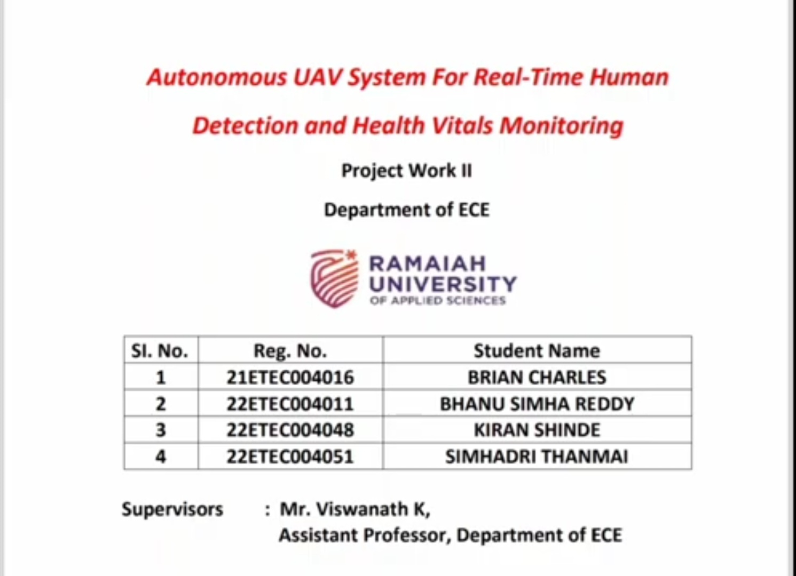

# Autonomous-Health-Vitals-UAV
Autonomous AI Assisted UAV system utilizing YOLOv8-Pose for threat tracking and non-contact rPPG and facial landmark analysis for real-time health vitals monitoring.
## 📺 Project Presentation Video
Click the thumbnail below to watch the complete technical presentation and system demonstration:

## 💻 Core Software Architecture (`final3.py`)

The backbone of this autonomous UAV system is housed in `final3.py`. It is engineered as a highly optimized, asynchronous, multi-threaded pipeline written in Python 3. This script handles high-rate data acquisition, real-time computer vision inference, complex digital signal processing (DSP), and low-latency telemetry streaming concurrently.

### 🏗️ Threading & Asynchronous Pipeline Model
To prevent video frame drops and ensure real-time execution on resource-constrained edge hardware (Raspberry Pi 5), the system decouples heavy computational workloads into independent concurrent execution streams:

* **Thread 1: Video Capture & AI Inference Loop** — Captures high-definition matrices from the PiCamera2, runs the YOLOv8-Pose tracking model, extracts regions-of-interest (ROIs) from facial landmarks using MediaPipe, and drops processed matrices into thread-safe queues.
* **Thread 2: Flight Controller MAVLink Stream** — Asynchronously polls the Pixhawk flight controller via `pymavlink` to extract real-time vehicle GPS coordinates, altitude, airspeed, and battery status flags.
* **Async Event Loop: WebSocket Server & IoT Alerts** — Built using `asyncio` and `websockets` to continuously push multi-variable JSON telemetry telemetry arrays down a low-latency network tunnel to active client dashboards at 5Hz, while handling non-blocking Telegram Bot API network requests during incident alerts.

---

### 🧮 Mathematical & Signal Processing Engine
Instead of relying on simple averages, the script implements an advanced Remote Photoplethysmography (rPPG) pipeline to extract precise blood-volume pulse (BVP) variations from microscopic facial skin color fluctuations:

1. **ROI Isolation:** MediaPipe tracks facial landmark matrices dynamically to isolate the forehead and cheek skin regions, ignoring background noise.
2. **POS Algorithm:** Implements the **Plane-Orthogonal-to-Skin (POS)** algorithm to project the RGB color channels into an orthogonal subspace, completely eliminating motion artifacts caused by the drone's flight vibrations.
3. **Butterworth Filter:** The raw BVP signal is passed through a **Digital 2nd-Order Butterworth Bandpass Filter** bounded between $0.7\text{ Hz}$ and $4.0\text{ Hz}$ (corresponding to a human heart rate range of 42 to 240 BPM).
4. **Welch's PSD Estimation:** Applies **Welch’s Periodogram Power Spectral Density (PSD)** calculation on the filtered signal array. The highest energy peak in the frequency spectrum is isolated to calculate the exact Heart Rate (BPM) and Respiratory Rate (RPM).

---

### 🚀 Key Code Modules Included
* `start_async_server()`: Initializes a production-grade asynchronous gateway on local network port `8765` for client connections.
* `register_client()` & `broadcast_telemetry()`: Manages safe client registries and handles simultaneous data blasting to connected Android application dashboards.
* `process_vitals_pipeline()`: Executes the core mathematical matrix arrays, detrending steps, and spectral density calculations.
* `trigger_emergency_alert()`: Packages incident frames, GPS strings, and health status matrices into multi-part form payloads for instantaneous IoT routing.

## 📁 Project Documentation
The complete engineering documentation and presentation materials are structured in the [Documentation](./Documentation) directory:

## 📁 Project Documentation
The complete engineering documentation and presentation materials are structured in the [Documentation](./Documentation) directory:

* 📄 [Project Thesis](https://github.com/briancharles5805/Autonomous-Health-Vitals-UAV/blob/43f0e834d87d7bccf0478222a053a7c3ec309ec7/Documentation/Project%20Thesis.pdf) — A comprehensive, 68-page dissertation detailing the mathematical core (rPPG signal analysis), multi-threaded pipeline design, and experimental validation.
* 📊 [Seminar Slides](https://github.com/briancharles5805/Autonomous-Health-Vitals-UAV/blob/18ba139738012fc85065afe78f6e318ce91104d5/Documentation/Seminar%20Slides.pdf) — Technical presentation slides outlining the core hardware architecture, Edge-AI inference loops, and real-time telemetry systems.
